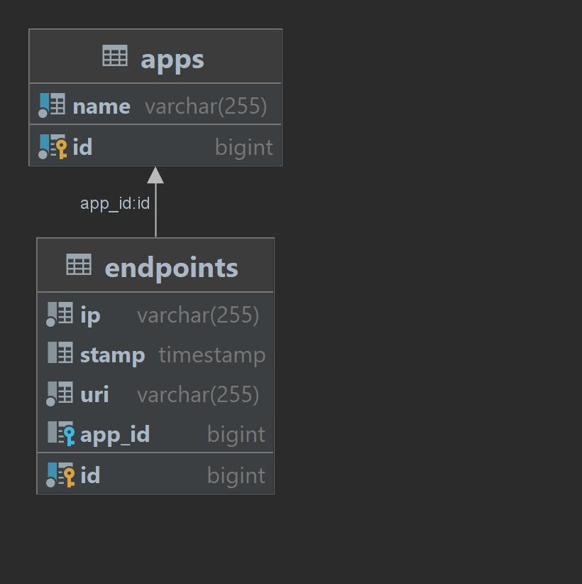

# java-explore-with-me
#Дипломный проект java-explore-with-me    
##<a href= "https://github.com/TatianaAV/java-explore-with-me/pull/6" >ссылка на Pull Request GitHub</a>    
##Схема базы данных основного сервиса    
<picture>
    <source media="(prefers-color-scheme: light)" srcset="main-serv/src/main/resources/ewm-service.jpg">
    
</picture>    
##Схема базы данных сервиса статистики    
<picture>
    <source media="(prefers-color-scheme: light)" srcset="stats/stats-server/src/main/resources/Endpoints.jpg">
    
</picture>  
